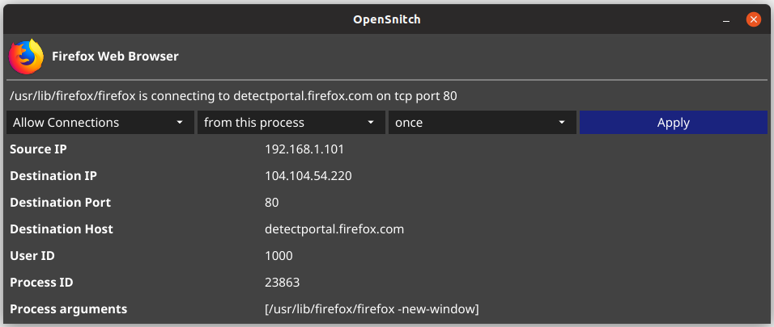

# Fyne OpenSnitch

An [OpenSnitch](https://github.com/evilsocket/opensnitch) UI in Go using [Fyne](https://fyne.io)

The application is running as a gRPC server on a unix socket and will interact with OpenSnitch daemon.

> Note: THIS SOFTWARE IS WORK IN PROGRESS, DO NOT EXPECT IT TO BE BUG FREE AND DO NOT RELY ON IT FOR ANY TYPE OF SECURITY.

## Requirements

- OpenSnitch [daemon](https://github.com/evilsocket/opensnitch#daemon) >= v1.0.0b
- Fyne [dependencies](https://github.com/fyne-io/fyne#prerequisites) to compile the application

## Running

Ensure the OpenSnitch daemon is configured and running.

    go build -o fyne-opensnitch && ./fyne-opensnitch

And you should see a main window containting the OpenSnitch Network Statistics like the following:

and every time an action is required to add a new rule:

