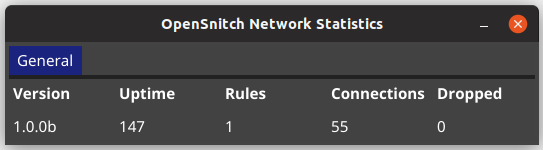

# Fyne OpenSnitch

An [OpenSnitch](https://github.com/evilsocket/opensnitch) UI in Go using [Fyne](https://fyne.io)

The application is running as a gRPC server on a unix socket and will interact with OpenSnitch daemon.

**THIS SOFTWARE IS WORK IN PROGRESS, DO NOT EXPECT IT TO BE BUG FREE AND DO NOT RELY ON IT FOR ANY TYPE OF SECURITY.**

## Requirements

- OpenSnitch [daemon](https://github.com/evilsocket/opensnitch#daemon) >= v1.0.0b
- Fyne [dependencies](https://github.com/fyne-io/fyne#prerequisites) to compile the application

#### UI Configuration

By default the UI will load its configuration from `~/.opensnitch/ui-config.json` (customizable with the `--config` argument), the default contents of this file are:

```json
{
    "default_timeout": 15,
    "default_action": "allow",
    "default_duration": "until restart",
    "default_operand":"process.path"
}
```

The `default_timeout` is the number of seconds after which the UI will take its
default action, the `default_action` can be `allow` or `deny` and the
`default_duration`, which indicates for how long the default action should be
taken, can be `once`, `until restart` or `always` to persist the action as a new
rule on disk. `default_operand` indicates the operand type to use for
the rule, can be `process.path` (the path of the executable), `user.id`,
`dest.ip`, `dest.host` or `dest.port`.

For more details about rules please refer to the [opensnitch readme](https://github.com/evilsocket/opensnitch/blob/master/README.md#rules).

## Running

Ensure the OpenSnitch daemon is configured and running.

    go build -o fyne-opensnitch && ./fyne-opensnitch

And you should see a main window containting the OpenSnitch Network Statistics like the following:



and every time an action is required to add a new rule:


## Credits

- [OpenSnitch](https://github.com/evilsocket/opensnitch)
- [Fyne](https://github.com/fyne-io/fyne)
- [Statik](https://github.com/rakyll/statik) for the static assets embedding
- [GNOME Terminal](https://github.com/GNOME/gnome-terminal) for the [terminal icon](https://github.com/GNOME/gnome-terminal/blob/gnome-3-32/data/icons/hicolor_apps_scalable_org.gnome.Terminal.svg)